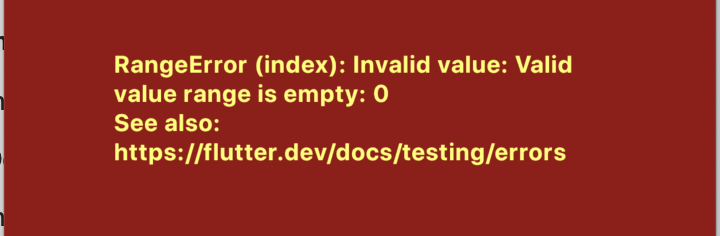
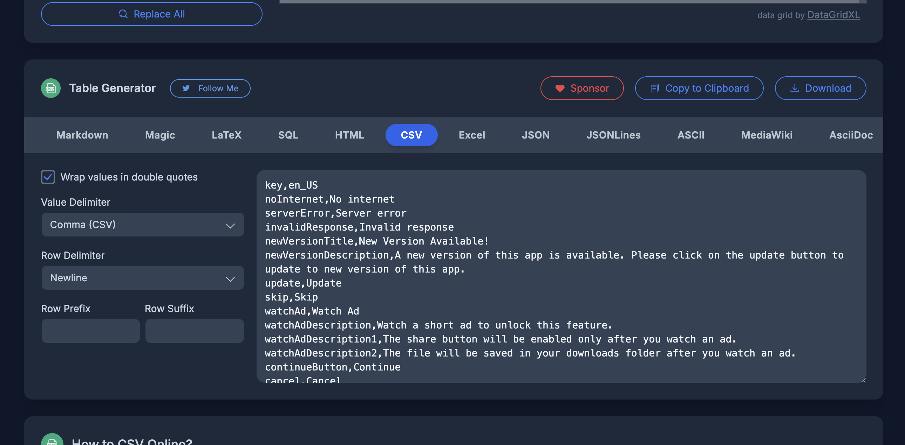

# Flutter Base Project MVVM

A robust Flutter foundation with comprehensive features for modern mobile app development.

## 🚀 Core Features

- **MVVM Architecture** with `get_it` dependency injection
- **Multi-language Support** via `easy_localization`
- **Light & Dark Themes** with seamless switching
- **Responsive Design** with extensions (`10.h`, `20.0.w`)
- **State Management** using `Provider`
- **Environment Configuration** with `.env` support
- **Debug Flavor** for development
- **Keyboard Actions** for enhanced input field UX
- **Custom Modal Progress HUD** for loading indicators
- **Animated Bottom Navigation** with `flutter_animate`

## 🔧 Recent Updates

### ✅ **Enhanced Router System**
- **Named Routes** with type-safe navigation
- **Centralized Route Management** in `AppRoutes` enum
- **Deep Linking Support** with `onGenerateRoute`
- **Navigation Utilities** for push, replace, and remove operations

### ✅ **Platform Optimizations**
- **Android**: Migrated to Kotlin DSL (`build.gradle.kts`)
- **iOS**: Updated to latest configurations
- **Removed**: Linux, macOS, Windows, and Web platforms for mobile focus
- **Splash Screen**: Custom splash icon with native implementation

### ✅ **Image & Camera Features**
- **Camera Integration** with `camera` package
- **Image Picker** from gallery or camera
- **Image Cropping** with `image_cropper`
- **Compression** with `flutter_image_compress`
- **Aspect Ratio Correction** - maintains desired preview ratio
- **Mixin-based** reusable image logic

### ✅ **Network & API**
- **Dio HTTP Client** with interceptors
- **Retry Logic** for network disconnections
- **Progress-based Uploads** for files
- **Enhanced Error Handling**

### ✅ **Firebase Integration**
- **Remote Config** with forced update popup
- **Analytics & Crashlytics** for monitoring
- **AdMob Integration** for monetization
- **Forced Update System** with version checking

## 📱 Settings Features

- **Privacy Policy & Terms of Use** - External URL launching
- **Rate App** - In-app review integration
- **Share App** - Platform-specific store links
- **Contact Us** - Auto-fills device info, country, and app details
- **Theme switching** - Light/Dark mode toggle

## 🛠️ Setup

### Prerequisites
- Flutter SDK
- Dart SDK
- Firebase CLI

### Quick Start

1. **Environment Setup**
   ```bash
   # Create .env file
   echo "DEBUG=true" > .env
   ```

2. **Firebase Configuration**
   ```bash
   flutterfire configure
   ```

3. **Run the Project**
   ```bash
   flutter pub get
   flutter run
   ```

## 🐛 Troubleshooting

### Translation CSV Error
If you encounter a range error with `translations.csv`:



**Quick Fix:**
```bash
git checkout assets/translations/translations.csv
```

**Regenerate CSV:**
1. Copy your `translations.csv` content
2. Go to [TableConvert CSV Generator](https://tableconvert.com/csv-generator)
3. Paste content and download as CSV



## 📦 Dependencies

- **State Management**: `provider`, `get_it`
- **UI**: `flutter_animate`, `gap`, `flutter_svg`, `fluttertoast`
- **Networking**: `dio`, `connectivity_plus`
- **Storage**: `shared_preferences`, `path_provider`
- **Media**: `camera`, `image_picker`, `image_cropper`, `flutter_image_compress`
- **Firebase**: `firebase_core`, `firebase_analytics`, `firebase_crashlytics`, `firebase_remote_config`
- **Localization**: `easy_localization`
- **Device Info**: `package_info_plus`, `device_info_plus`
- **Utilities**: `in_app_review`, `share_plus`, `url_launcher`, `keyboard_actions`

## 📁 Project Structure

```
lib/
├── config/
│   ├── router/          # Named routes & navigation
│   └── config.dart      # App configuration
├── core/
│   ├── extensions/      # Responsive extensions
│   ├── services/        # Firebase services
│   └── utils/           # Helper utilities
├── views/
│   ├── mixins/          # Reusable mixins
│   └── *.dart           # Screen implementations
└── widgets/             # Reusable components
```

---

**Note**: This project is optimized for mobile development (iOS/Android) with all desktop and web platforms removed for cleaner maintenance.
